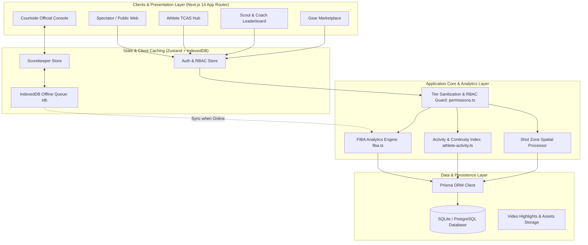
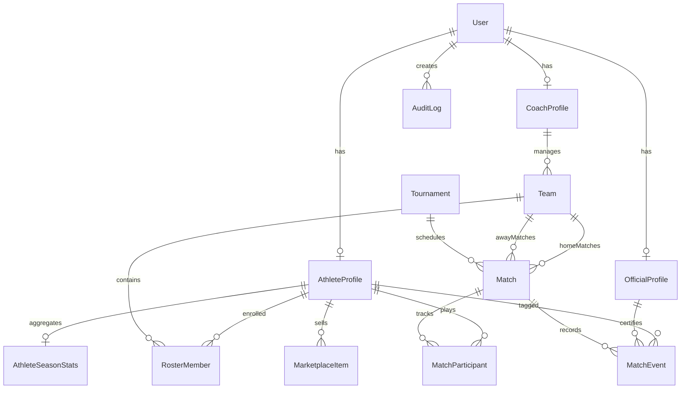
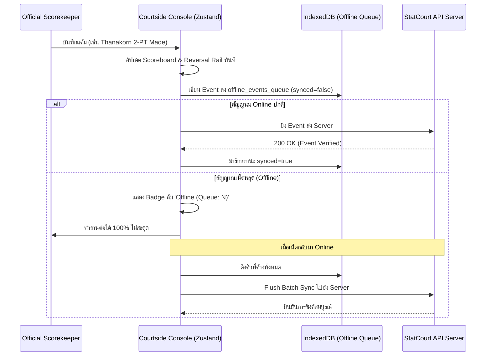
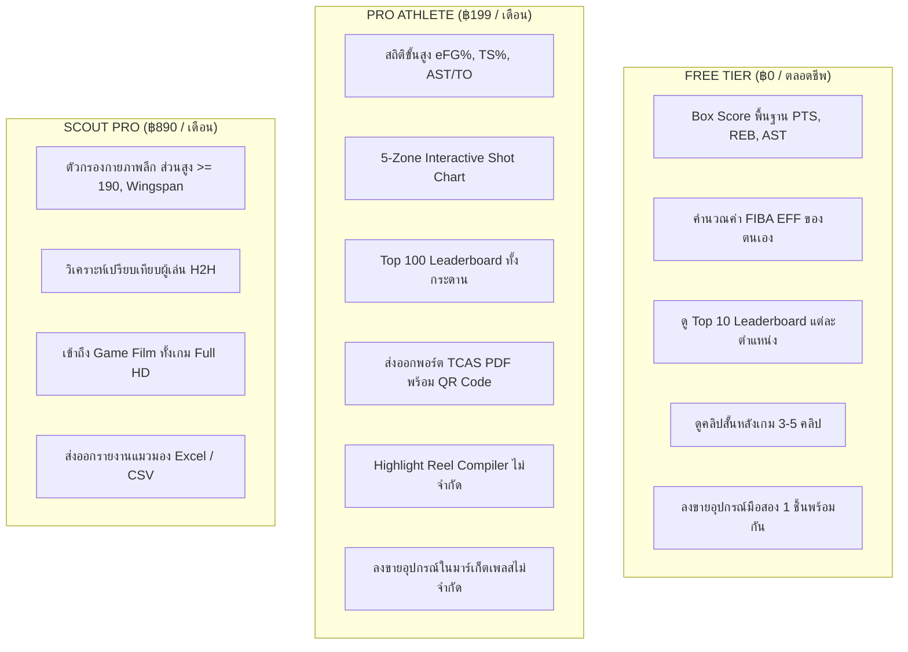

# 🏀 StatCourtTH — System Architecture & Design Specification (DESIGN.md)

> **STATCOURT.TH**: แพลตฟอร์มบันทึกสถิติ วิเคราะห์ข้อมูล และเชื่อมโยงโอกาสนักกีฬาบาสเกตบอลระดับเยาวชนและระดับรากหญ้าของประเทศไทย (Thailand Grassroots Basketball Analytics, Scouting & TCAS Athlete Hub)

---

## 📑 สารบัญ (Table of Contents)
1. [ภาพรวมของระบบและวิสัยทัศน์ (System Vision & Problem Statement)](#1-ภาพรวมของระบบและวิสัยทัศน์)
2. [สถาปัตยกรรมระบบโดยรวม (System Architecture)](#2-สถาปัตยกรรมระบบโดยรวม)
3. [ระบบการออกแบบ (Design System & Visual Language)](#3-ระบบการออกแบบ-design-system)
   - 3.1 [Typography Scale & Typefaces](#31-typography-scale)
   - 3.2 [Color Tokens & Palette](#32-color-tokens--palette)
   - 3.3 [UI Components & Layout Patterns](#33-ui-components--layout-patterns)
4. [โครงสร้างข้อมูลและฐานข้อมูล (Database Schema & Data Models)](#4-โครงสร้างข้อมูลและฐานข้อมูล)
5. [กลไกการวิเคราะห์สถิติมาตรฐาน FIBA (FIBA Analytics Engine)](#5-กลไกการวิเคราะห์สถิติมาตรฐาน-fiba)
   - 5.1 [FIBA Efficiency (EFF)](#51-fiba-efficiency-eff)
   - 5.2 [Advanced Shooting Metrics (eFG%, TS%)](#52-advanced-shooting-metrics)
   - 5.3 [Assist-to-Turnover & Per-40 Rates](#53-assist-to-turnover--per-40-rates)
   - 5.4 [Continuous Match Experience & Activity Index](#54-continuous-match-experience--activity-index)
   - 5.5 [5-Zone Court Shot Chart](#55-5-zone-court-shot-chart)
6. [ระบบโต๊ะเทคนิคและการทำงานออฟไลน์ (Courtside Console & Offline-First)](#6-ระบบโต๊ะเทคนิคและการทำงานออฟไลน์)
7. [ระบบวิดีโอและมัลติแคม (Hudl-Grade Game Film & Multi-Cam Arena)](#7-ระบบวิดีโอและมัลติแคม)
8. [ระบบ TCAS Portfolio & Player Trading Cards](#8-ระบบ-tcas-portfolio--player-trading-cards)
9. [โมเดลธุรกิจและการจำกัดสิทธิ์ (Freemium & RBAC Tiering)](#9-โมเดลธุรกิจและการจำกัดสิทธิ์)
10. [ตลาดอุปกรณ์นักกีฬา (Student-Athlete Peer Gear Marketplace)](#10-ตลาดอุปกรณ์นักกีฬา)
11. [เทคโนโลยีสแตกและแนวทางการพัฒนา (Tech Stack & Development Guidelines)](#11-เทคโนโลยีสแตกและแนวทางการพัฒนา)

---

## 1. ภาพรวมของระบบและวิสัยทัศน์

### 1.1 ปัญหาของวงการบาสเกตบอลเยาวชนไทย (The Grassroots Problem)
1. **ขาดความน่าเชื่อถือของสถิติ (Stat Credibility Gap)**: การแข่งขันระดับเยาวชนมักจดใบบันทึกคะแนนด้วยกระดาษ ข้อมูลสูญหาย ไม่ได้มาตรฐาน FIBA และไม่มีการตรวจสอบย้อนกลับ (Verification)
2. **อุปสรรคการยื่นพอร์ตโควตากีฬา TCAS (TCAS Athlete Verification)**: นักเรียน ม.ปลาย ที่ต้องการเข้าศึกษาต่อมหาวิทยาลัยชั้นนำผ่านโควตานักกีฬา ขาดเอกสารรับรองที่เป็นกลาง มีเพียงรูปถ่ายหรือคำบอกเล่า ขาดคลิปวิดีโออ้างอิงช็อตต่อช็อต
3. **การเข้าถึงแมวมองและโค้ช (Scouting Invisibility)**: ช้างเผือกในต่างจังหวัดไม่มีช่องทางให้โค้ชทีมชาติหรือมหาวิทยาลัยเห็นผลงาน หากไม่เดินทางมาแข่งในกรุงเทพฯ
4. **ภาระค่าใช้จ่ายอุปกรณ์ (Equipment Accessibility)**: รองเท้าบาสเกตบอลและอุปกรณ์เสริมของแท้มีราคาสูง นักกีฬาเยาวชนต้องการตลาดส่งต่ออุปกรณ์ที่ไว้ใจได้ระหว่างเพื่อนนักกีฬา

### 1.2 พันธกิจของ StatCourtTH (Our Mission)
StatCourtTH สร้าง Digital Infrastructure ครบวงจรสำหรับบาสเกตบอลไทย ตั้งแต่โต๊ะเทคนิคกรรมการข้างสนาม, การวิเคราะห์ขั้นสูงตามเกณฑ์ FIBA LiveStats, การเชื่อมโยงไทม์สแตมป์วิดีโอกับสถิติ, พอร์ตโฟลิโอ TCAS พร้อมรหัสตรวจสอบ QR Code, จนถึงระบบซื้อขายอุปกรณ์มือสองระหว่างนักกีฬา

---

## 2. สถาปัตยกรรมระบบโดยรวม



---

## 3. ระบบการออกแบบ (Design System)

การออกแบบของ StatCourtTH ยึดแนวคิด **"Elite Athletic High-Performance Broadcast"** — ผสมผสานความดุดันของสนามบาสเกตบอลระดับ NBA เข้ากับความแม่นยำระดับห้องวิเคราะห์ข้อมูลของ FIBA

### 3.1 Typography Scale

| Token Class | Font Family | Size (Desktop) | Line Height | Letter Spacing | Weight | การใช้งานหลัก |
|---|---|---|---|---|---|---|
| `font-headline-xl` | Bebas Neue | 54px (Mobile 48px) | 56px | 0.04em | 400 | Hero Titles, หัวข้อสถิติหลัก |
| `font-headline-lg` | Bebas Neue | 36px | 40px | 0.03em | 400 | Page Header, Scoreboard Points |
| `font-headline-md` | Bebas Neue | 24px | 28px | 0.02em | 400 | Card Headings, Modal Titles |
| `font-headline-sm` | Barlow Condensed | 18px | 22px | 0.01em | 700 | Subsection Labels, Player Positions |
| `font-title-stat` | Bebas Neue | 32px | 32px | 0.01em | 400 | เลขตัวเลขสถิติเด่น (EFF, PPG, RPG) |
| `font-body-lg` | Barlow Condensed | 16px | 22px | Normal | 600 | Highlight text, ตารางข้อมูลสำคัญ |
| `font-body-md` | Barlow Condensed | 14px | 20px | Normal | 500 | เนื้อหาบทความ, คำอธิบายฟิลด์ |
| `font-body-sm` | Barlow Condensed | 12px | 16px | Normal | 500 | Metadata, Timestamp, ข้อความย่อย |
| `font-label-caps` | Barlow Condensed | 11px | 14px | 0.08em | 700 | Tag ชื่อหมวดหมู่, ตัวพิมพ์ใหญ่ทั้งหมด |
| `font-label-badge`| Barlow Condensed | 10px | 12px | 0.06em | 700 | ป้ายสถานะ (LIVE, VERIFIED, PRO) |

### 3.2 Color Tokens & Palette

ระบบใช้ชุดสีที่ออกแบบมาเฉพาะเพื่อสะท้อนความดุดันของกีฬาบาสเกตบอล (Crimson & Tactical Ink) ตัดกับพื้นผิวคอนทราสต์สูง

```
Primary Crimson:     ████ #AF101A (Brand Primary)
Primary Container:   ████ #D32F2F (Action Buttons, Live Badges)
Primary Fixed:       ████ #FFDAD6 (Subtle Red Highlights)
Inverse Surface:     ████ #213145 (Tactical Slate, Video Overlays)
Surface Base:        ████ #F8F9FF (Clean Ice Stadium White)
Surface Container:   ████ #E5EEFF (Subtle Card Background)
Gold Accent:         ████ #FBBC30 (Trophy, MVP, TCAS Elite)
Verified Emerald:    ████ #15803D (BSAT Verified Stats)
Warning Amber:       ████ #B45309 (Pending Review, Table Warnings)
```

#### Tailwind Palette Mapping

```typescript
// tailwind.config.ts
colors: {
  brand: {
    primary: "#DC2626", // Red 600
    crimson: "#991B1B", // Red 800
    subtle: "#FEE2E2",  // Red 100
    glow: "#EF4444",    // Red 500
  },
  surface: {
    base: "#F8FAFC",      // Slate 50
    container: "#FFFFFF", // Pure White
    muted: "#F1F5F9",     // Slate 100
    dark: "#0F172A",      // Slate 900
    card: "#FFFFFF",
  },
  primary: "#af101a",
  "primary-container": "#d32f2f",
  "inverse-surface": "#213145",
  "surface-container": "#e5eeff",
  "tertiary-fixed-dim": "#fbbc30",
  verifiedGreen: { DEFAULT: "#15803D", light: "#DCFCE7" },
  pendingAmber: { DEFAULT: "#B45309", light: "#FEF3C7" }
}
```

### 3.3 UI Components & Layout Patterns
- **Glassmorphism & Tactical Overlays**: การซ้อนข้อมูลสถิติทับวิดีโอด้วยพื้นหลังเบลอ `backdrop-blur-md` สไตล์ Broadcast
- **Court Pulse & Radar Animations**: เอฟเฟกต์ไฟกระพริบเมื่อมีการแข่งสด (`pulse-radar`)
- **Court Grid Pattern**: ลวดลายตารางยุทธวิธีบนสนามบาสเกตบอล (`court-grid-pattern`) ใน Hero Sections
- **Action Reversal Rail (Undo)**: แถบย้อนประวัติการกดคะแนนข้างสนาม พร้อมแถบสีเตือนเพื่อป้องกัน Human Error

---

## 4. โครงสร้างข้อมูลและฐานข้อมูล (Database Schema)

ระบบใช้ **Prisma ORM** ควบคู่กับ SQLite (ในขั้นตอนพัฒนา) และรองรับ PostgreSQL สำหรับ Production



### Entity สรุปสำคัญ
1. **User**: บัญชีผู้ใช้งานกลาง ระบุ `Role` (`ATHLETE`, `COACH`, `OFFICIAL`, `ADMIN`)
2. **AthleteProfile**: ข้อมูลกายภาพนักกีฬา (ส่วนสูง, น้ำหนัก, ความกว้างช่วงแขน Wingspan, ความสูงยืนเอื้อม Standing Reach, จังหวัด, สังกัดโรงเรียน, รหัสยืนยัน TCAS)
3. **AthleteSeasonStats**: สถิติรวมและค่าเฉลี่ยมาตรฐาน FIBA (EFF, eFG%, TS%, AST/TO, PER, Radar Ratings)
4. **OfficialProfile**: กรรมการและเจ้าหน้าที่โต๊ะเทคนิค ระบุสมาคมต้นสังกัด (เช่น BSAT) พร้อมสถานะการรับรอง
5. **Match & MatchEvent**: บันทึกเกมการแข่งขันและทุก Event ย่อย (แต้มยิง, ฟาวล์, เทิร์นโอเวอร์) ผูกเวลาบาสเกตบอล และวินาทีวิดีโอ (`videoElapsedSec`)
6. **MarketplaceItem**: สินค้ารองเท้าและอุปกรณ์กีฬา พร้อมฟังก์ชันระบุนักกีฬาที่เคยสวมใส่ (`wornByAthletes`)

---

## 5. กลไกการวิเคราะห์สถิติมาตรฐาน FIBA

StatCourtTH ยึดตามมาตรฐานการคำนวณของ **FIBA Official Basketball Rules & FIBA LiveStats**

### 5.1 FIBA Efficiency (EFF)
ดัชนีประสิทธิภาพทางการแข่งขันอย่างเป็นทางการของ FIBA:

$$\text{EFF} = (\text{PTS} + \text{REB} + \text{AST} + \text{STL} + \text{BLK}) - [(\text{FGA} - \text{FGM}) + (\text{FTA} - \text{FTM}) + \text{TO}]$$

- **Positive Factors**: ทำแต้ม, รีบาวด์ (เกมรุก + เกมรับ), แอสซิสต์, สตีล, บล็อก
- **Negative Factors**: ยิงลูกฟิลด์โกลพลาด, ยิงลูกโทษพลาด, เสียเทิร์นโอเวอร์

```typescript
export function calculateFibaEff(stats: PlayerGameStats): number {
  const positive = stats.pts + (stats.oreb + stats.dreb) + stats.ast + stats.stl + stats.blk;
  const missedFg = stats.fga - stats.fgm;
  const missedFt = stats.fta - stats.ftm;
  const negative = missedFg + missedFt + stats.to;
  return positive - negative;
}
```

### 5.2 Advanced Shooting Metrics

#### Effective Field Goal Percentage (eFG%)
ชดเชยน้ำหนักของลูกยิง 3 แต้มที่มีมูลค่ามากกว่า 2 แต้ม:

$$\text{eFG\%} = \frac{\text{FGM} + 0.5 \times \text{3PM}}{\text{FGA}} \times 100$$

#### True Shooting Percentage (TS%)
วัดประสิทธิภาพการทำคะแนนโดยรวมจากการยิงฟิลด์โกลและลูกโทษ:

$$\text{TS\%} = \frac{\text{PTS}}{2 \times (\text{FGA} + 0.44 \times \text{FTA})} \times 100$$

### 5.3 Assist-to-Turnover & Per-40 Rates
- **Assist-to-Turnover Ratio**: $\frac{\text{AST}}{\text{TO}}$
- **FIBA Per-40 Minutes Scaling**: ปรับสเกลสถิติให้เท่ากับเวลาการแข่งขันมาตรฐาน 40 นาที (4 ควอเตอร์ ควอเตอร์ละ 10 นาที):

$$\text{Stat}_{\text{Per40}} = \frac{\text{Stat}}{\text{Minutes}} \times 40$$

### 5.4 Continuous Match Experience & Activity Index
ดัชนีวัดประสบการณ์และความต่อเนื่องในการลงเล่น (Experience & Continuity):
- แบ่งกรอบเวลา: **1 เดือนย้อนหลัง (1M)**, **6 เดือนย้อนหลัง (6M)**, **1 ปีย้อนหลัง (1Y)**, และ **ตลอดการเล่น (ALL)**
- บันทึกจำนวนแมตช์, จำนวนทัวร์นาเมนต์ที่เข้าร่วม, และจำนวนนาทีเฉลี่ยที่ได้ลงเล่นต่อเกม (`avgMinutesPerGame`)
- ช่วยให้โค้ชและแมวมองทราบว่านักกีฬามีความต่อเนื่องของฟอร์มการเล่นหรือไม่

### 5.5 5-Zone Court Shot Chart
ระบบจำแนกโซนการยิง 5 โซนตามพิกัดสนามมาตรฐาน:
1. `PAINT_RESTRICTED`: บริเวณใต้แป้นและในเขตกำหนด
2. `MID_RANGE`: ระยะกลาง 2 คะแนน
3. `CORNER_3_LEFT`: มุมสามแต้มฝั่งซ้าย
4. `CORNER_3_RIGHT`: มุมสามแต้มฝั่งขวา
5. `ABOVE_BREAK_3`: สามแต้มส่วนบนและหัวกะโหลก

---

## 6. ระบบโต๊ะเทคนิคและการทำงานออฟไลน์ (Courtside Console)

โต๊ะเทคนิคข้างสนามมักประสบปัญหาสัญญาณ Wi-Fi หรือ Cellular ไม่เสถียรในโรงยิม StatCourtTH ออกแบบด้วยสถาปัตยกรรม **Offline-First Resilience**:



### ฟีเจอร์สำคัญของ Courtside Console
- **PIN Authorization**: ป้องกันคนนอกเข้าแก้ไขผล ต้องใส่รหัส PIN กรรมการโต๊ะ (`7788`, `1234`) พร้อมเลขที่ใบอนุญาต BSAT
- **Integrated Shot Clock**: สลับรีเซ็ตเวลารุก 24 วิ และ 14 วิ สำหรับ Offensive Rebound
- **Reversal Action Rail**: มีปุ่ม Undo สำหรับแก้คำสั่งย้อนหลังได้ทันที พร้อมบันทึก Audit Log ชัดเจน

---

## 7. ระบบวิดีโอและมัลติแคม (Game Film & Multi-Cam Arena)

StatCourtTH นำเสนอประสบการณ์การรับชมแบบ Hudl-Grade:
1. **Interactive Event Timestamping**: ทุกแต้ม, ทุกบล็อก, ทุกสตีลใน Play-by-Play จะมีเวลา `videoElapsedSec` ผูกไว้ เมื่อผู้ชมหรือโค้ชคลิกที่เหตุการณ์ วิดีโอจะกระโดดไปยังจังหวะนั้นทันที
2. **Multi-Cam Switcher**: สลับมุมมองกล้องถ่ายทอดสดได้หลายมุม (`CAM1: Tactical Wide`, `CAM2: Baseline Attack`, `CAM3: Court-side Zoom`)
3. **Live Fan Chat & Team Cheer**: ห้องเชียร์สดแยกสีทีม (เช่น BCC ปะทะ Debsirin)

---

## 8. ระบบ TCAS Portfolio & Player Trading Cards

หนึ่งในจุดแข็งหลักของระบบ คือการช่วยนักเรียน ม.ปลาย ยื่นคัดเลือกเข้ามหาวิทยาลัยรอบโควตากีฬา (TCAS Portfolio):

### 8.1 องค์ประกอบพอร์ตโฟลิโอ TCAS มาตรฐาน
- **Verified Official Badge**: ตราประทับรับรองความถูกต้องของสถิติจากผู้ควบคุมการแข่งขัน (BSAT / Tournament Director)
- **Verified QR Code Verification**: สแกนคิวอาร์โค้ดแล้วเปิดดูวิดีโอไฮไลต์จริงของนักกีฬาคนนั้นทันที ป้องกันการแอบอ้าง
- **Highlight Reel Compiler**: เครื่องมือตัดต่อคลิปไฮไลต์ความยาว 1 นาที ที่รวบรวมเพลย์สำคัญ (Buzzer Beater, Clutch Plays, Chasedown Blocks) จากการแข่งขันจริง
- **Physical Measurements**: ระบุส่วนสูง, น้ำหนัก, Wingspan, ยืนเอื้อม (Standing Reach) และสังกัดเดิม

### 8.2 Player Trading Card
การ์ดภาพนิ่งและภาพเคลื่อนไหวของนักกีฬาสำหรับแชร์บน Social Media (Instagram, TikTok, Facebook) แสดงค่าพลัง Radar Chart 4 ด้าน:
- **Scoring (ทำแต้ม)**
- **Playmaking (สร้างสรรค์เกม)**
- **Defense (เกมรับ)**
- **Athleticism (ความคล่องแคล่วและสมรรถภาพร่างกาย)**

---

## 9. โมเดลธุรกิจและการจำกัดสิทธิ์ (Freemium & RBAC Tiering)

StatCourtTH ใช้โมเดล **Freemium ที่เป็นธรรม**: นักกีฬาทุกคนสามารถเข้าถึงข้อมูลพื้นฐานได้ฟรีตลอดชีพ ขณะที่ฟีเจอร์ระดับมืออาชีพจะสงวนไว้สำหรับสมาชิก PRO



### การควบคุมสิทธิ์ที่ระดับ Logic (Security Guard)
ไฟล์ [`lib/permissions.ts`](file:///c:/Users/Asus/StatCourtTH/lib/permissions.ts) ทำหน้าที่เป็น Single Source of Truth สำหรับการ Sanitize ข้อมูล:
- หากผู้ใช้เป็น `FREE` ระบบจะตัดฟิลด์ `trueShootingPct`, `effectiveFgPct`, `astToRatio`, และ `shotChartData` ออกจาก Payload เพื่อป้องกันการดักจับผ่าน Inspect Network

---

## 10. ตลาดอุปกรณ์นักกีฬา (Student-Athlete Peer Gear Marketplace)

เพื่อลดภาระค่าใช้จ่ายของครอบครัวนักกีฬา StatCourtTH มีระบบซื้อขายรองเท้าและอุปกรณ์มือสอง:
- **Worn By Athletes**: เชื่อมโยงอุปกรณ์กับโปรไฟล์นักกีฬาที่เคยสวมใส่จริงในสนามแข่งขัน
- **Condition Grading**: กำหนดมาตรฐานสภาพชัดเจน (`Brand New`, `Mint 9.5/10`, `Good 8.5/10`, `Used 7/10`)
- **Safe Escrow & In-Person Handover**: รองรับระบบนัดรับตามสนามแข่ง (เช่น สนามกีฬานิมิบุตร, สยามสแควร์) หรือระบบคนกลางตรวจสอบสินค้า

---

## 11. เทคโนโลยีสแตกและแนวทางการพัฒนา

### 11.1 Tech Stack Matrix
| ส่วนประกอบ (Component) | เทคโนโลยีที่เลือกใช้ (Technology) | เหตุผลและความสำคัญ |
|---|---|---|
| **Framework** | Next.js 14.2 (App Router) | Server-Side Rendering ที่เร็ว, SEO Friendly, Static Opt |
| **Language** | TypeScript 5.6 | Type safety สำหรับสถิติกีฬาที่มีความซับซ้อนสูง |
| **State Management** | Zustand 4.5 | จัดการ Global State เช่น การเข้าสู่ระบบ, โต๊ะคะแนนสด |
| **Styling** | Tailwind CSS 3.4 | ปรับแต่ง Utility ตาม Design System Tokens อย่างรวดเร็ว |
| **Offline Persistence** | `idb` (IndexedDB Wrapper) | ทนทานต่อเน็ตหลุดข้างสนาม ไม่สูญเสียสถิติแม้รีเฟรชหน้า |
| **Icons & Display** | Lucide React + Material Symbols | สัญลักษณ์กีฬาและอินเทอร์เฟซที่ชัดเจน |
| **Data Visualizations** | Recharts 3.10 | กราฟแนวโน้มฟอร์ม EFF, Shot Chart, Radar Rating |
| **ORM & Database** | Prisma 5.22 + SQLite / Postgres | Schema ยืดหยุ่น มั่นคงในการ Query สถิติสัมพันธ์ |
| **PDF Generation** | HTML2Canvas + Native Print CSS | แปลงพอร์ตโฟลิโอ TCAS เป็นเอกสารทางการ |

### 11.2 คำสั่งการทำงานของโปรเจกต์
- เริ่มต้น Development Server: `npm run dev` (พอร์ต `3000`)
- ตรวจสอบ Unit Test: `npm test` (รันการคำนวณ FIBA, สิทธิ์ RBAC, ดัชนีความต่อเนื่อง)
- รัน Prisma Studio ตรวจสอบข้อมูล: `npx prisma studio`
- Seed ข้อมูลเริ่มต้น: `npx prisma db seed`

---

*เอกสารฉบับนี้จัดทำขึ้นเป็นคู่มือการออกแบบและพัฒนาอย่างเป็นทางการของโครงการ **StatCourtTH** เพื่อรักษามาตรฐานคุณภาพทั้งด้านประสบการณ์ผู้ใช้งาน (UX/UI), ความถูกต้องของสถิติการแข่งขัน, และความปลอดภัยของระบบ.*
